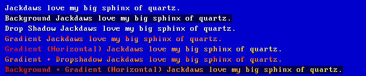

# bfontjs

A bitmap font library for rendering to canvas objects in HTML5.  Uses an image and a character coordinates table to render the specified font in the specified colour.

# Bundle Targets

- Browser Compatible: COMPLETE
- CommonJS Compatible: IN PROGRESS

# Current Version (0.2.0)

Currently implemented features:

See the `test.js` file for a examples.

# Planned Features

- Monospace bitmap source fonts: COMPLETE
- Render in specified colour: COMPLETE
- CLI to compile codepage + bitmap as a font: NOT STARTED
- Render Effects
    - Solid Background: COMPLETED
    - Underline: NOT STARTED
    - Outline: NOT STARTED
    - Drop shadow: NOT STARTED
    - Render with gradient: COMPLETED
- Variable space bitmap fonts: COMPLETED
- Scaling: NOT STARTED
- Justification: NOT STARTED
- Word wrap: NOT STARTED

# Getting Started

## Browser Bundle

Copy the contents of `/dist/bfontjs.js` to your project and include it in your HTML file with ``.  When you execute your scripts, the `bfontjs` module will be available in the global scope.

At appropriate points in your script you can load a precompiled font with `bfontjs.LoadFromJSON(json)` (where `json` is the precompiled font's JSON file contents) and later render it to the screen with `bfontjs.DrawText(ctx, font, x, y, message, hexColor))` (where `ctx` is a 2d context object you generated from a canvas element with `canvas.getContext('2d')` and `font` is the precompiled font you loaded.).

## Node (CommonJS)

Type `npm i bfontjs --save-dev` while in your projects folder's in the console.  Then include it in your project with `require`.

## Node (ES6)

Type `npm i bfontjs --save-dev` while in your projects folder's in the console.  Then include it in your project with `import`.

## Canvas Dependency

The ES6 and CommonJS versions rely on the canvas npm library to render to canvas without the DOM.

# Compiled Fonts

The precompiled fonts consist of a `codepage` object with each character the font has and an object with that characters x and y location on the font's bitmap and how wide and high it is, and an `imagedata` object that contains the base64 image data from the font's bitmap.  This JSON object can be loaded into the `bfontjs.LoadFromJSON` method to initialize the font that draws the text.

The DOS default 256 character 'codepage 437' font is compiled already in the `/src/fonts/` folder, eventually a CLI script will allow you to specify a codepage and image to bundle together to make your own precompiled font.